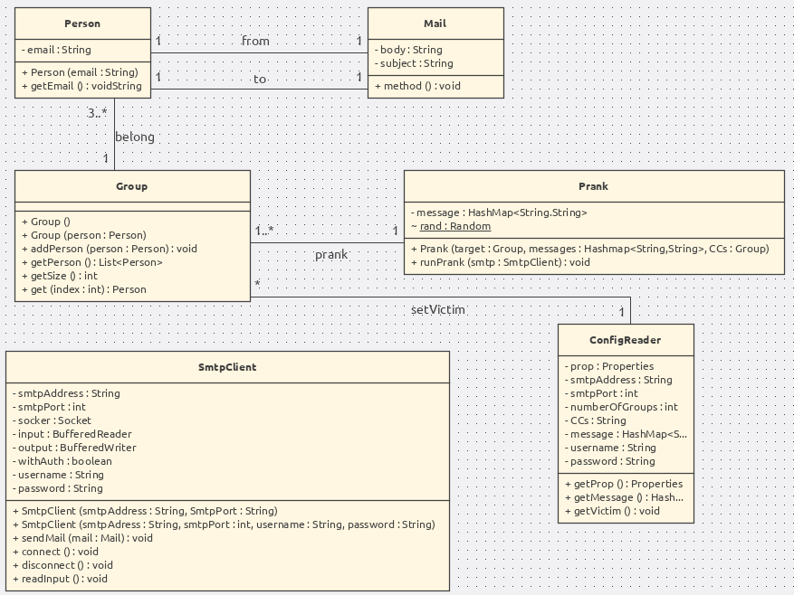

# Basic SMTP Prank
#### Author : Bonjour Mickael & Mettler Samuel

## Description
This application allows you to forge emails. Subjects, contents and targets are all available and free to edit for your own pleasure. The application will connect to a chosen SMTP server and send a certain amount of email depending on the choice of the user.

## Functionalities 
- The user is able to define a list of victims by editing the file _mailTarget.utf8_ located in the config folder. It is also possible to keep the default values we provided. The format is the following :  
```
address@email.com  
secondAddress@email.com
...
```
- The user is able to define how many groups of victims should be formed in a given campaign. The user is able to edit the number of groups in the file _config.properties_ located in the config folder. The default value is 5.
- The user is able to define a list of email messages. When a prank is played on a group of victims, one of the messages is selected. The mail is sent by one of the victim to all the others. Obviously he won't send an email to himself. The group are made of 3 persons at least. 


## How to use

There are differents way you can test our tool. In the description below we will use a Docker image to emulate the SMTP server. Docker is a tool to wrap an application from your environment and which contain all that is needed to run this application locally on your machine. This guarantees that the software will always run the same, regardless of its environment.  
Since we are really nice guys, all you have to do use the application is to run the following command from the root folder :
```
sudo chmod +x launchPrank.sh 
sudo chmod +x startPrank.sh
./lauchPrank.sh
./startPrank.sh
```
If you want to see the result connect to localhost:8282 on your browser. 
To send more email you just have to launch the second script.

Please be advised that the port 2525 matchs the SmtpPort in the file _config.properties_. It needs to be the same to work properly. Please change accordingly.


## Implementation Detail

### Class Diagram


### Description

All is about the ConfigReader : It will check all the proprieties stored in the config file.  
We can therefore create victim group and get the content of email (body + subject).  
We can then look at the class Prank. It will use the message found by the ConfigReader to generate prank. To run a prank it will need a smtpClient.  
A SMTP client is build thanks to the information given in the configuration file. This client will connect to a socket and exchange with the server to send email. 


